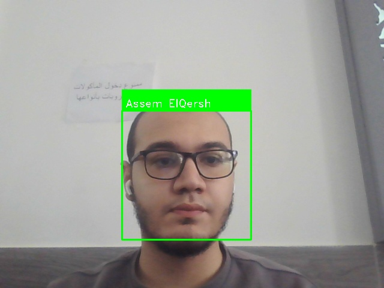

# Real-Time Face Detection and Recognition

## Project Overview
This project implements real-time face detection and recognition using OpenCV. It can detect faces in video streams and recognize known faces using template matching. The system is designed to be user-friendly, efficient, and easily extensible.

## Demo
  
*Demo showing real-time face detection and recognition in action.*

## Features
- Real-time face detection using OpenCV's Haar Cascade classifier
- Face recognition using template matching
- Support for webcam input
- Known face database management
- Real-time display of recognition results
- Save frames from video stream
- Add new faces in real-time

## Installation

### Prerequisites
- Python 3.7 or higher
- Webcam

### Step-by-Step Setup
1. **Clone the repository:**
   ```bash
   git clone https://github.com/Assem-ElQersh/Real-time-Face-Detection.git
   cd Real-time-Face-Detection
   ```

2. **Create a virtual environment (optional but recommended):**
   ```bash
   python -m venv venv
   source venv/bin/activate  # On Windows: venv\Scripts\activate
   ```

3. **Install dependencies:**
   ```bash
   pip install -r requirements.txt
   ```

4. **Download the required model file:**
   - Create a `models` directory in the project root:
     ```bash
     mkdir models
     ```
   - Download the face landmark predictor model:
     - Visit [dlib's official website](http://dlib.net/files/shape_predictor_68_face_landmarks.dat.bz2)
     - Extract the downloaded file
     - Place `shape_predictor_68_face_landmarks.dat` in the `models` directory

### Troubleshooting
- If you encounter issues with `face_recognition` or `dlib`, try reinstalling them:
  ```bash
  pip uninstall face-recognition dlib
  pip install face-recognition dlib
  ```
- If the webcam doesn't open, try changing the camera index in `face_recognition.py`:
  ```python
  video_capture = cv2.VideoCapture(1)  # Try different numbers (0, 1, 2)
  ```

## Usage

### Adding Known Faces
Add faces to the database using the `add_face.py` script:
```bash
python add_face.py --name "Person Name" --image path/to/face/image.jpg
```
Or add faces in real-time while running the system (press 'a').

### Running the Face Recognition System
Start the face recognition system:
```bash
python face_recognition.py
```

### Controls
While running the face recognition system:
- Press 'q' to quit
- Press 's' to save the current frame
- Press 'a' to add a new face to the database

## Configuration
- **Camera Index:** Change the camera index in `face_recognition.py` if your webcam isn't detected.
- **Model Path:** Ensure the model file is correctly placed in the `models` directory.

## Contributing
Contributions are welcome! Please feel free to submit a Pull Request. For major changes, please open an issue first to discuss what you would like to change.

## License
This project is licensed under the MIT License - see the [LICENSE](/LICENSE) file for details.

## FAQ
1. **Q: Why is the face recognition accuracy low?**  
   A: Ensure good lighting, clear images, and follow the image guidelines. Add more faces of the same person from different angles.

2. **Q: How do I change the camera?**  
   A: Modify the camera index in `face_recognition.py` (e.g., `cv2.VideoCapture(1)`).

3. **Q: Can I use this on a Raspberry Pi?**  
   A: Yes, but performance may vary. Ensure you have sufficient processing power.

## Image Guidelines

For best recognition results, follow these guidelines when adding faces:
1. Face should be clearly visible and centered
2. Good lighting (not too dark or bright)
3. Clear, non-blurry image
4. Face should take up about 20-30% of the image
5. Neutral expression or slight smile
6. No sunglasses or face coverings

## Directory Structure

- `known_faces/`: Directory containing all known face images
  - Each person has their own subdirectory (e.g., `known_faces/John_Doe/`)
  - Face images are saved with timestamps (e.g., `face_20240321_123456.jpg`)
- `known_faces.pkl`: Database file containing face data and names
- `models/`: Directory containing face detection models
  - `shape_predictor_68_face_landmarks.dat`: Face landmark predictor model (download separately)

## Requirements

- Webcam
- Python 3.7+
- OpenCV
- NumPy

## Troubleshooting

1. If the webcam doesn't open, try changing the camera index in `face_recognition.py`:
   ```python
   video_capture = cv2.VideoCapture(1)  # Try different numbers (0, 1, 2)
   ```

2. If face recognition accuracy is low:
   - Add more faces of the same person from different angles
   - Ensure good lighting conditions
   - Follow the image guidelines above

3. If the system is slow:
   - Close other applications
   - Reduce the video resolution
   - Use a more powerful computer 
